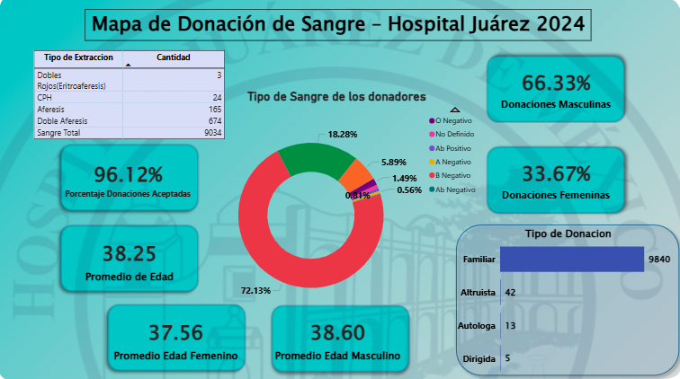

## Analisis_de_Donaciones_de_Sangre_Hospital_Juarez_2024

🩸 Mapa de Donación de Sangre – Hospital Juárez de México (2024)
Dashboard de Análisis · SQL + Power BI

Este proyecto analiza la distribución de donación de sangre en el Hospital Juárez de México durante el año 2024.
Incluye la limpieza de datos, modelado SQL, creación de KPIs y construcción de un dashboard profesional en Power BI.

## 📊 Tecnologías utilizadas

PostgreSQL – Limpieza, creación de tablas y KPIs

SQL – Consultas analíticas, agregaciones y cálculos

Power BI – Visualización, diseño y presentación final

CSV – Dataset original

## 🛠 Proceso aplicado
1. Limpieza y preparación de datos en SQL
   
📁 [Ver Dataset](./donacion_sangre_hjm_2024.csv)

📁 [Ver Codigo SQL](./Donaciones_de_Sangre_HJM_2024.sql)

    -Normalización de columnas
    
    -Corrección de tipos de dato
    
    -Creación de tablas KPI:
    
    -kpi_estado_donador
    
    -kpi_tipo_donacion
    
    -kpi_tipo_extraccion
    
    -kpi_sexo
    
    -kpi_promedio_edad
    
    -kpi_promedio_edad_sexo

3. Exportación a Power BI

      -Importación individual de KPIs sin relaciones
      
      -Construcción del dashboard tipo “infografía”
      
      -Diseño visual inspirado en un sistema solar (donut central = núcleo)

## ⭐ KPIs principales

   -% Donaciones aceptadas

   -Distribución por tipo sanguíneo

   -Distribución por género

   -Promedio de edad general y por sexo

   -Tipos de donación

   -Tipos de extracción
   
## 🎨 Diseño del dashboard

Imagen del dashboard final:

📌 

## 🔍 Insights principales

La mayoría de las donaciones fueron aceptadas (96%).

El 66% de los donantes fueron hombres.

El tipo de sangre más común donado fue O+.

Promedio de edad general: 38.25 años.

El HJM tiene alta participación de donadores con extracción “Doble Aféresis” y “Sangre Total”.
